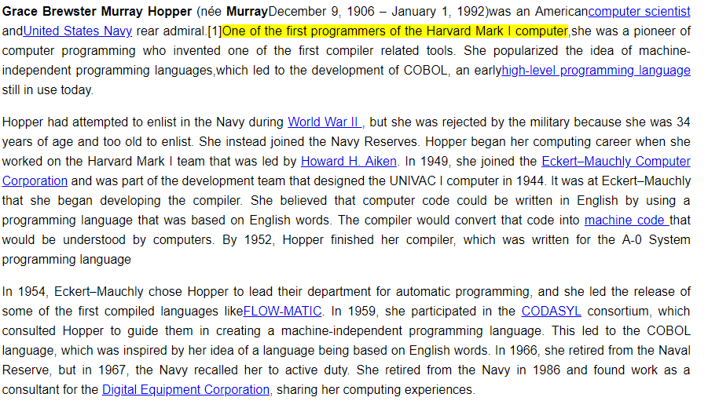
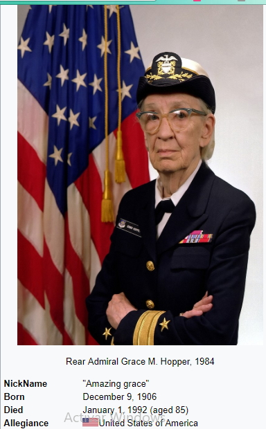
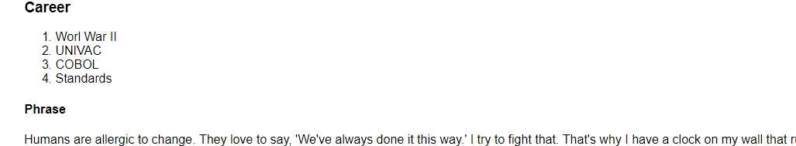

# Grace-Hooper

El presente trabajo es un replica de la pagina web de Grace Hooper de Wikipedia. para poder poner en práctica los conocimientos sobre como crear componentes en React.

### INSTALACION

Para poder usar realizar de manera rapida  debemos incluir dos archivos en el proyecto.

Se utiliza el generador create-react-app

1. Desde el node comand ejecutar npm install -g create-react-app para la Instalación.
2. Luego ejecutar create-react-app my-app para crear la aplicación.
3. Y se debe ingresar a la aplicación mediane cd my-app.
4. Finalmente se debe de ejecutar la aplicación con npm start.

### CREACION DE COMPONETES

**Header**

```js
   import React, { Component } from 'react';
    import './Header.css';
    class Header extends Component {
     render() {
      return (
        <div className="Header-title">
          <h1>Grace Hopper</h1>
        </div>
    );
  }
}
export default Header;
```
De esta manera, se lograra genar la siguiente imagen


**Main**

```Javascript
   import React, { Component } from 'react';
   import './Main.css';
  
   class Main extends Component {
  	render() {
		     return(
    <main class= "principal-info">
     <p><strong>Grace Brewster Murray Hopper</strong> (née <strong>Murray</strong>; December 9, 1906 – January 1, 1992) was an American <a href="https://en.wikipedia.org/wiki/Computer_scientist" target="_blank">computer scientist</a> and <a href="https://en.wikipedia.org/wiki/United_States_Navy" target="_blank">United States</a> Navya <a href="https://en.wikipedia.org/wiki/Rear_admiral_(United_States)" target="_blank">rear admiral</a>.<mark>One of the first programmers of the Harvard Mark I computer</mark>, she was a pioneer of computer programming who invented one of the first compiler related tools. She popularized the idea of machine-independent programming languages, which led to the development of COBOL, an early high-level programming language still in use today.
     </p>
     <p>Hopper had attempted to enlist in the Navy during <a href="https://en.wikipedia.org/wiki/World_War_II" target="_blank">World War II </a>, but she was rejected by the military because she was 34 years of age and too old to enlist. She instead joined the Navy Reserves. Hopper began her computing career when she worked on the Harvard Mark I team that was led by <a href="https://en.wikipedia.org/wiki/Howard_H._Aiken"target="_blank">Howard H. Aiken</a>. In 1949, she joined the <a href="https://en.wikipedia.org/wiki/Eckert%E2%80%93Mauchly_Computer_Corporation" target="_blank">Eckert–Mauchly Computer Corporation</a>  and was part of the development team that designed the UNIVAC I computer in 1944. It was at Eckert–Mauchly that she began developing the compiler. She believed that computer code could be written in English by using a programming language that was based on English words. The compiler would convert that code into <a href="https://en.wikipedia.org/wiki/Machine_code "target="_blank"> machine code </a> that would be understood by computers. By 1952, Hopper finished her compiler, which was written for the A-0 System programming language</p>
     <p>In 1954, Eckert–Mauchly chose Hopper to lead their department for automatic programming, and she led the release of some of the first compiled languages like <a href="https://en.wikipedia.org/wiki/FLOW-MATIC" target="_blank">FLOW-MATIC</a>. In 1959, she participated in the <a href="https://en.wikipedia.org/wiki/CODASYL"target="_blank">CODASYL</a> consortium, which consulted Hopper to guide them in creating a machine-independent programming language. This led to the COBOL language, which was inspired by her idea of a language being based on English words. In 1966, she retired from the Naval Reserve, but in 1967, the Navy recalled her to active duty. She retired from the Navy in 1986 and found work as a consultant for the <a href="https://en.wikipedia.org/wiki/Digital_Equipment_Corporation"target="_blank">Digital Equipment Corporation</a>,sharing her computing experiences.</p>
     <p>Owing to her accomplishments and her naval rank, she was sometimes referred to as "Amazing Grace".The U.S. Navy Arleigh
     Burke-class guided-missile destroyer <a href="https://en.wikipedia.org/wiki/USS_Hopper"target="_blank">USS Hopper</a> was named for her, as was the Cray XE6 "Hopper" supercomputer at NERSC.
     During her lifetime, Hopper was awarded 40 honorary degrees from universities across the world. In 1991, she received the
     <a href="https://en.wikipedia.org/wiki/National_Medal_of_Technology_and_Innovation"target="_blank">National Medal of Technology</a>. On November 22, 2016, she was posthumously awarded the Presidential Medal of Freedom by
     President Barack Obama.</p>
   </main>
 );
}
}

  export default Main;

```
De esta manera, se lograra genar la siguiente imagen



**Table**

```Javascript
import React, { Component } from 'react';
import './Table.css';
import grace from './grace.jpg'

class Table extends Component {
	render() {
		return (
			<div class="Summary">
         <table class="Summary-table">
           <thead>
             <tr>
             <th colspan="2">Grace Murray Hopper</th>
             </tr>
           </thead>
           <tbody>
             <tr>
             <td colspan="2">
               
               <p>Rear Admiral Grace M. Hopper, 1984</p>
             </td>
           </tr>
           <tr>
             <th>NickName</th>
             <td>"Amazing grace"</td>
           </tr>
           <tr>
             <th>Born</th>
             <td>December 9, 1906</td>
           </tr>
           <tr>
             <th>Died</th>
             <td>January 1, 1992 (aged 85)</td>
           </tr>
           <tr>
             <th>Allegiance</th>
             <td>
             United States of America</td>
           </tr>
         </tbody>
       </table>
     </div>
		);
	}
}

export default Table;

```
De esta manera, se lograra genar la siguiente imagen



**Content**

```js
   import React, { Component } from 'react';
   import './Content.css';

  class Content extends Component {
    render() {
        return (
          <section>             
            <h3 className= "content-info">Career</h3>
            <ol className="content-info">
              <li> Worl War II</li>
              <li> UNIVAC </li>
              <li> COBOL </li>
              <li> Standards </li>
            </ol>
            <h4 className="content-info">Phrase</h4> 
						<blockquote cite="http://www.azquotes.com/quote/553883"> Humans are allergic to change. They love to say, 'We've always done it this way.' I try to fight that. That's why I have a clock on my wall that runs counter-clockwise. </blockquote>
          </section>
      	);
		}
  }
```
De esta manera, se lograra genar la siguiente imagen



## HERRAMIENTAS
* React

  Es una librería Javascript focalizada en el desarrollo de interfaces de usuario.


